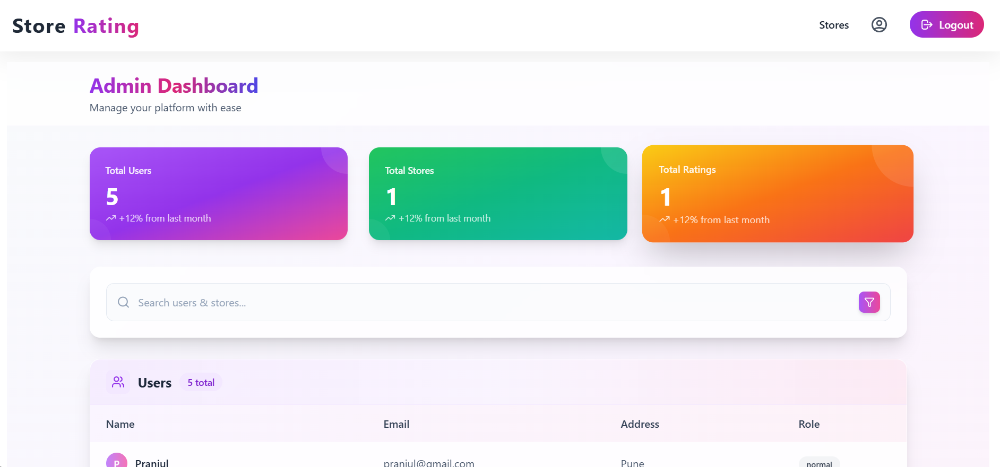
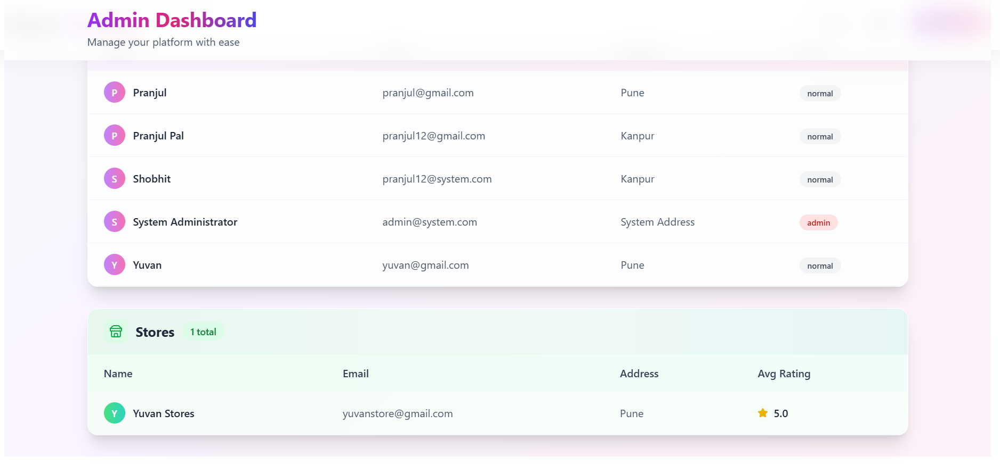
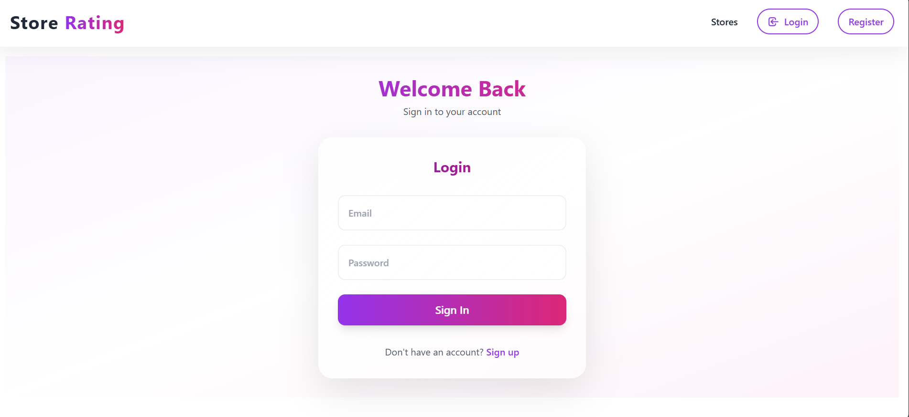
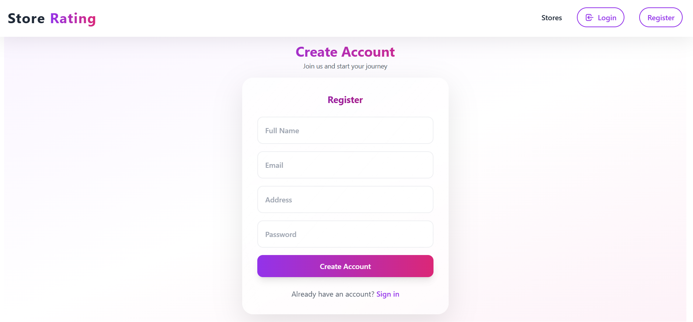
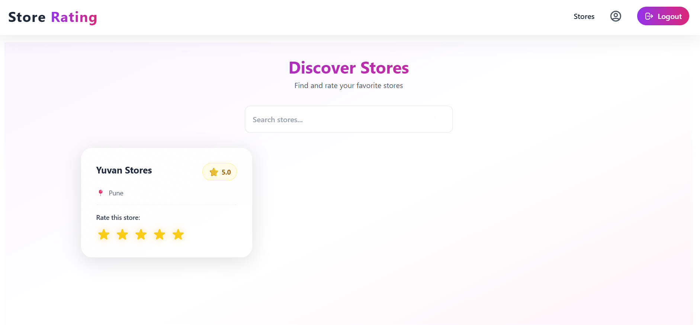

# 🏪 Store Rating Platform

A full-stack MERN web application that allows users to view, rate, and manage store ratings with role-based access control.

## 🌐 Live Demo

> Coming Soon (Deploy to Vercel / Render / Netlify)

## 📸 Preview






<!-- Replace or remove if not available -->

---

## 🚀 Features

- 🌍 Public store listing with search
- ⭐ Authenticated users can rate stores (1–5 stars)
- 🔐 Role-based access:
  - **Normal User** – rate stores
  - **Store Owner** – view own store & ratings
  - **Admin** – manage users and stores
- 📊 Average & user-specific ratings
- 🧾 Login/Register with JWT auth
- 💅 Beautiful responsive UI (TailwindCSS)

---

## 🛠 Tech Stack

**Frontend:**
- React
- React Router
- Tailwind CSS
- Axios
- React Hot Toast

**Backend:**
- Node.js
- Express.js
- PostgreSQL (via Supabase)
- JWT Authentication
- Bcrypt

**Database:**
- Supabase (PostgreSQL hosting)
- pg Node package
- SQL tables created dynamically

---

## 🗃️ Folder Structure

```
store-rating/
├── frontend/      # React App
├── backend/       # Node/Express API
├── .gitignore
└── README.md
```

---

## ⚙️ Setup Instructions

### 1. Clone the repository

```bash
git clone https://github.com/itsPranjul/store-rating.git
cd store-rating
```

### 2. Install dependencies

#### Backend
```bash
cd backend
npm install
```

#### Frontend
```bash
cd ../frontend
npm install
```

---

### 3. Environment Variables

Create `.env` files in both `frontend/` and `backend/`.

#### 📦 `backend/.env`
```env
PORT=5000
JWT_SECRET=yourSuperSecretKey
DATABASE_URL=your_supabase_connection_string_here
```

> You can find the **connection string** in Supabase under:
> `Project > Settings > Database > Connection Info`

#### 💻 `frontend/.env`
```env
REACT_APP_API_BASE=http://localhost:5000/api
```

---

### 4. Run the app locally

#### Start backend:
```bash
cd backend
npm run dev
```

#### Start frontend:
```bash
cd ../frontend
npm start
```

---

## 🗄️ Supabase Setup

1. Go to [https://app.supabase.com](https://app.supabase.com) and create a new project
2. Navigate to **SQL Editor** and run the schema from your `initDb.js` (or auto-create via backend)
3. Copy your PostgreSQL connection string from `Settings > Database`
4. Paste it into your `backend/.env` as `DATABASE_URL`

Tables used:
- `users` (id, name, email, password, role, etc.)
- `stores` (id, name, address, owner_id)
- `ratings` (id, user_id, store_id, rating)

---

## 🔐 Roles in App

| Role            | Access                                                   |
|-----------------|----------------------------------------------------------|
| **Normal User** | Register/Login, View stores, Submit rating               |
| **Store Owner** | View own store, See received ratings                     |
| **Admin**       | Manage all stores & users (create, assign roles, etc.)   |

---

## 📬 API Endpoints (Sample)

| Method | Endpoint              | Description                    |
|--------|-----------------------|--------------------------------|
| POST   | `/api/auth/register`  | User registration              |
| POST   | `/api/auth/login`     | Login                          |
| GET    | `/api/stores`         | List all stores (public)       |
| POST   | `/api/ratings`        | Submit or update rating        |
| GET    | `/api/admin/users`    | Admin-only: list users         |

---

## 👨‍💻 Author

**Pranjul Pal**  
🌐 [GitHub @itsPranjul](https://github.com/itsPranjul)

---

